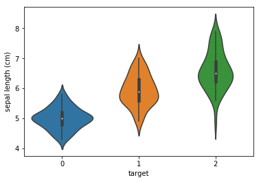
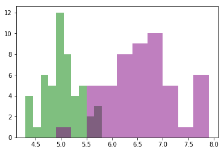

### Questions


## Hypothesis Testing -> Frequentist Approach
    * Answer a question by looking at n-events or an event for n-days/minutes. 
    * Example: Which medicine is better, A B or C
        * A - Placebo
        * B - Medicine 1
        * C - Medicine 2
        * run the experiments, conclude that Medicine 1 is better, then administer that to people. 
    
    * Pros/Cons
        * (con) you might have outliers
        * You might be able to pull causality out of this (pro)
            * Causal Inference
        * (pro) repeatable
        * (con) you administered something not as good to people for some time. 
        

## Bayesian Approach
    * Multi-Arm Bandit Approach
    * tune your MAB model to be greedy or exploratory. 
        * greedy means if it sees a positive effect from a treatment: A, then it will give A to more people and stop giving the lesser treatment. 
        * exploratory means, it can randomly decide to try a treatment that has a lesser effect to see if that's really the case. 

### Objectives
YWBAT
* apply hypothesis testing to groups
* meeting test critera


### What is it? 
- Hypothesis testing is a methodology for measuring the differences between groups of people. 

* Experimental Design
    * Length of time or some other duration
    * Control Groups and Experimental Groups
    * Record data

### Scenarios
* Medical Research
    * Control Group, Test Group A, Test Group B, Test Group C
        * check if a drug has an effect on some statistic of the indidvuals in the groups. 
* Comparing battery types or designs
* Compare webpages
* Compare algorithms
* Compare ads

### Outline


```python
import pandas as pd
import numpy as np

import scipy.stats as scs
from sklearn.datasets import load_iris

import matplotlib.pyplot as plt
import seaborn as sns
```


```python
iris = load_iris()
data = iris.data
target = iris.target
features = iris.feature_names
```


```python
print(iris.DESCR)
```

    .. _iris_dataset:
    
    Iris plants dataset
    --------------------
    
    **Data Set Characteristics:**
    
        :Number of Instances: 150 (50 in each of three classes)
        :Number of Attributes: 4 numeric, predictive attributes and the class
        :Attribute Information:
            - sepal length in cm
            - sepal width in cm
            - petal length in cm
            - petal width in cm
            - class:
                    - Iris-Setosa
                    - Iris-Versicolour
                    - Iris-Virginica
                    
        :Summary Statistics:
    
        ============== ==== ==== ======= ===== ====================
                        Min  Max   Mean    SD   Class Correlation
        ============== ==== ==== ======= ===== ====================
        sepal length:   4.3  7.9   5.84   0.83    0.7826
        sepal width:    2.0  4.4   3.05   0.43   -0.4194
        petal length:   1.0  6.9   3.76   1.76    0.9490  (high!)
        petal width:    0.1  2.5   1.20   0.76    0.9565  (high!)
        ============== ==== ==== ======= ===== ====================
    
        :Missing Attribute Values: None
        :Class Distribution: 33.3% for each of 3 classes.
        :Creator: R.A. Fisher
        :Donor: Michael Marshall (MARSHALL%PLU@io.arc.nasa.gov)
        :Date: July, 1988
    
    The famous Iris database, first used by Sir R.A. Fisher. The dataset is taken
    from Fisher's paper. Note that it's the same as in R, but not as in the UCI
    Machine Learning Repository, which has two wrong data points.
    
    This is perhaps the best known database to be found in the
    pattern recognition literature.  Fisher's paper is a classic in the field and
    is referenced frequently to this day.  (See Duda & Hart, for example.)  The
    data set contains 3 classes of 50 instances each, where each class refers to a
    type of iris plant.  One class is linearly separable from the other 2; the
    latter are NOT linearly separable from each other.
    
    .. topic:: References
    
       - Fisher, R.A. "The use of multiple measurements in taxonomic problems"
         Annual Eugenics, 7, Part II, 179-188 (1936); also in "Contributions to
         Mathematical Statistics" (John Wiley, NY, 1950).
       - Duda, R.O., & Hart, P.E. (1973) Pattern Classification and Scene Analysis.
         (Q327.D83) John Wiley & Sons.  ISBN 0-471-22361-1.  See page 218.
       - Dasarathy, B.V. (1980) "Nosing Around the Neighborhood: A New System
         Structure and Classification Rule for Recognition in Partially Exposed
         Environments".  IEEE Transactions on Pattern Analysis and Machine
         Intelligence, Vol. PAMI-2, No. 1, 67-71.
       - Gates, G.W. (1972) "The Reduced Nearest Neighbor Rule".  IEEE Transactions
         on Information Theory, May 1972, 431-433.
       - See also: 1988 MLC Proceedings, 54-64.  Cheeseman et al"s AUTOCLASS II
         conceptual clustering system finds 3 classes in the data.
       - Many, many more ...


### Scenario
* The intern just finished measuring the sepal length, width and petal length/width of 150 plants. You want to know, is there a difference in these measurements between groups? 


```python
df = pd.DataFrame(data, columns=features)
df['target'] = target
df.head()
```


<div>
<style scoped>
    .dataframe tbody tr th:only-of-type {
        vertical-align: middle;
    }

    .dataframe tbody tr th {
        vertical-align: top;
    }

    .dataframe thead th {
        text-align: right;
    }
</style>
<table border="1" class="dataframe">
  <thead>
    <tr style="text-align: right;">
      <th></th>
      <th>sepal length (cm)</th>
      <th>sepal width (cm)</th>
      <th>petal length (cm)</th>
      <th>petal width (cm)</th>
      <th>target</th>
    </tr>
  </thead>
  <tbody>
    <tr>
      <td>0</td>
      <td>5.1</td>
      <td>3.5</td>
      <td>1.4</td>
      <td>0.2</td>
      <td>0</td>
    </tr>
    <tr>
      <td>1</td>
      <td>4.9</td>
      <td>3.0</td>
      <td>1.4</td>
      <td>0.2</td>
      <td>0</td>
    </tr>
    <tr>
      <td>2</td>
      <td>4.7</td>
      <td>3.2</td>
      <td>1.3</td>
      <td>0.2</td>
      <td>0</td>
    </tr>
    <tr>
      <td>3</td>
      <td>4.6</td>
      <td>3.1</td>
      <td>1.5</td>
      <td>0.2</td>
      <td>0</td>
    </tr>
    <tr>
      <td>4</td>
      <td>5.0</td>
      <td>3.6</td>
      <td>1.4</td>
      <td>0.2</td>
      <td>0</td>
    </tr>
  </tbody>
</table>
</div>


### let's examine the sepal length of each group


```python
sns.violinplot(x='target', y='sepal length (cm)', data=df)
```


    <matplotlib.axes._subplots.AxesSubplot at 0x1a1f4f0b38>





### What do we notice about the distributions by type?
* group 0, has a median of 5 and most are shorter than the rest
* group 2, has a larger range, has a higher median, has outliers
* group 1, kind of in the middle


```python
sep_len_g0 = df.loc[df.target==0, 'sepal length (cm)']
sep_len_g1 = df.loc[df.target==1, 'sepal length (cm)']
sep_len_g2 = df.loc[df.target==2, 'sepal length (cm)']
```


```python
plt.hist(sep_len_g0, bins=10, color='g', alpha=0.5)
plt.hist(sep_len_g2, bins=10, color='purple', alpha=0.5)
plt.show()
```





### Error Types
- Type I Error: 
    - is the rejection of a true null hypothesis
    - You predict 1 but should have predicted 0 1-> True 0-> False
- Type II Error: 
    - failing to reject a false null hypothesis
    - You predict 0 but should have predicted 1. 
    
When do you want to minimize Type I Error? 
    * Approving someone for a home loan
    * Diagnosing Cancer

When do you want to minimize Type II Error?
    * Diagnosing a disease
    * Diagnosing Cancer

### Let's run a hypothesis test to test if there is a difference in the sepal length mean of the two groups


What type of ttest do we use? 
- independent ttest (2 sample ttest)
    - used to test 2 groups against one another


Step 1: Get your two groups separated
    
    
Step 2: Test assumptions
    - Normality of each group
    - Equal Variances


```python
# let's test for normality

print(scs.shapiro(sep_len_g0))
# p = 0.45 -> sep_len_g0 is normal with a confidence of 95%

print(scs.shapiro(sep_len_g2))
# p = 0.46 -> sep_len_g1 is normal with a confidence of 95%

```

    (0.9776989221572876, 0.4595281183719635)
    (0.9711798429489136, 0.25832483172416687)


```python
# let's test for equal variances
# H0: v1 = v2
# HA: v1 != v2
scs.levene(sep_len_g0, sep_len_g2)

# p = 0.001 -> reject the null hypothesis
# if variances are not equal, what do we do!!!!?
```


    LeveneResult(statistic=11.454002162818494, pvalue=0.0010271363228426178)


```python
# run the indepdent ttest with equal_var = False
# H0: mu1 = mu2
# HA: mu1 != mu2
t, p = scs.ttest_ind(sep_len_g0, sep_len_g2, equal_var=False)

print(p) 

# p ~ 0 -> reject the null hypothesis, 
# which means are means are different with 95% confidence
```

    3.9668672709859296e-25


```python
# What if these weren't normal groups? 

# Resampling methods to create a sampling distribution

sep_len_g0_means = []
sep_len_g2_means = []

# I'm going to use bootstrap sampling

for i in range(30):
    samp0 = np.random.choice(sep_len_g0, size=len(sep_len_g0), replace=True)
    samp2 = np.random.choice(sep_len_g2, size=len(sep_len_g2), replace=True)
    
    sep_len_g0_means.append(samp0.mean())
    sep_len_g2_means.append(samp2.mean())
```


```python
scs.shapiro(sep_len_g0_means), scs.shapiro(sep_len_g2_means)
```


    ((0.9506867527961731, 0.17636987566947937),
     (0.9579759240150452, 0.2747340500354767))


### Assessment


```python

```
